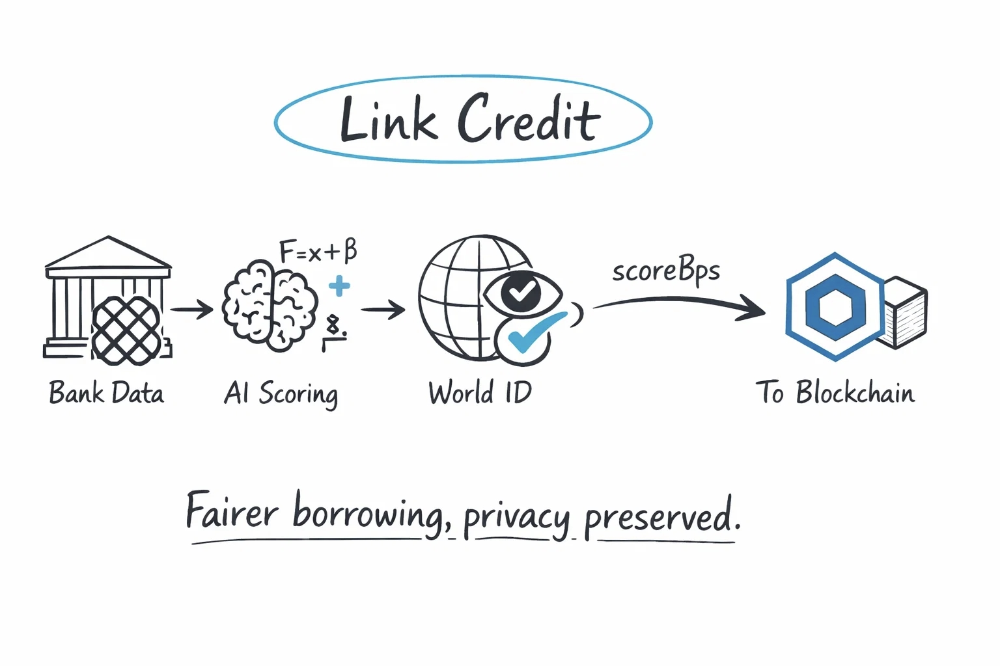

# Link Credit

Link Credit is a hackathon project built for **Chainlink CRE**:
[Chainlink Hackathon](https://chain.link/hackathon)

It introduces privacy-aware, identity-aware credit signals into DeFi lending, so users are not forced into purely one-size-fits-all collateral rules.

## Table of Contents

- [Demo](#demo)
- [Problem](#problem)
- [Key Building Blocks](#key-building-blocks)
- [End-to-End Flow](#end-to-end-flow)
- [Architecture](#architecture)
- [Credit Scoring Logic](#credit-scoring-logic)
- [Boost Composition](#boost-composition)
- [Why CRE Matters Here](#why-cre-matters-here)
- [Core Features](#core-features)
- [Repository Map](#repository-map)
- [Run Guide](#run-guide)
- [Appendix](#appendix)
  - [Chainlink Usage](#chainlink-usage)
  - [Tenderly Usage](#tenderly-usage)

## Demo

YouTube walkthrough:
[https://youtu.be/c6gPOyzxN7I](https://youtu.be/c6gPOyzxN7I)

## Problem

Most DeFi lending is over-collateralized by design. That protects protocols, but ignores two important facts:

- users have different real-world repayment behavior
- without Sybil resistance, one person can create many wallets and game credit logic

This project addresses both.

## Key Building Blocks

- **Plaid**: a financial data network used here (sandbox mode) to fetch user-permissioned account balances and transaction history.
- **World ID**: proof-of-personhood using zero-knowledge proofs; used here to enforce "one real person, one scoring identity" and reduce Sybil abuse.
- **Chainlink CRE**: workflow execution layer that orchestrates token exchange, data fetch, scoring, and on-chain writes.

## End-to-End Flow

1. User connects wallet and completes **Plaid Link** authorization first.
2. API creates Plaid link token and forwards workflow trigger payload.
3. CRE workflow exchanges `public_token`, fetches balances + transactions, computes score, and writes `scoreBps` on-chain.
4. User completes **World ID** verification.
5. Lending layer reads both signals and applies the final boost.

## Architecture



```text
Frontend (React)
  - Wallet connect
  - World ID verification
  - Plaid Link auth
  - Score + lending UI
        |
        v
API (Hono / Worker-compatible)
  - Plaid link token creation
  - Workflow trigger endpoints
  - Encrypted token storage
        |
        v
Chainlink CRE Workflow
  - Plaid token exchange
  - Plaid balances/transactions fetch
  - Rule score + AI calibration
  - On-chain score write
        |
        v
Contracts (Credit Oracle + Aave-based lending integration)
  - World ID-aware credit identity checks
  - Score storage (`scoreBps`)
  - Credit boost applied to lending parameters
```

## Credit Scoring Logic

Scoring is deterministic-first with bounded AI calibration:

`S_rule = 0.30*S_buf + 0.25*S_net + 0.20*S_inc + 0.15*S_spend + 0.10*S_risk`  
`S = clamp(S_rule + delta_ai, 0, 100), where delta_ai in [-10, 10]`

- `S_buf`: balance safety buffer
- `S_net`: net cashflow quality
- `S_inc`: income stability
- `S_spend`: spending discipline
- `S_risk`: risk event penalty (for example overdraft / NSF-like patterns)

Final on-chain value:

`scoreBps = S * 100`

Why AI adjustment is bounded:

- deterministic score remains the anchor for reproducibility
- AI handles edge cases without taking over the model
- `delta_ai` range is constrained to reduce drift and manipulation risk

## Boost Composition

- **Plaid boost**: derived from the credit score pipeline above (rule formula + bounded AI adjustment).
- **World ID boost**: fixed **+10%** if the user is verified.
- **Final boost**: additive.

`finalBoost = plaidBoost + worldIdBoost`

where:

- `worldIdBoost = 10%` if verified, otherwise `0%`
- `plaidBoost` is computed from `scoreBps`

The lending side applies protocol safety limits when needed.

## Why CRE Matters Here

CRE is the practical bridge between off-chain financial signals and on-chain risk logic:

- orchestrates multi-step external API workflow
- keeps scoring flow in one auditable execution pipeline
- writes final output back to contracts used by the lending path

This avoids building a heavy centralized backend for core scoring orchestration.

## Core Features

- World ID-based Sybil resistance gating
- Plaid sandbox integration for financial signals
- Hybrid rule + AI credit scoring
- On-chain score publication to oracle contract
- Credit-aware lending boost in an Aave-based flow

## Repository Map

- `packages/frontend` — dApp UI
- `packages/api` — link-token + trigger API
- `packages/workflow` — CRE credit scoring workflow
- `packages/worldid-workflow` — CRE workflow for World ID-related flow
- `packages/contracts` — contracts and deployment artifacts

## Run Guide

Setup and end-to-end execution steps are in:
[INTEGRATION.md](./INTEGRATION.md)

## Appendix

### Chainlink Usage

**Chainlink CRE**

Direct links to code using Chainlink CRE APIs:

- [packages/workflow/src/main.ts#L1-L17](packages/workflow/src/main.ts#L1-L17) - Import CRE SDK: `HTTPCapability`, `CronCapability`, `consensusIdenticalAggregation`, `EVMClient`, etc.
- [packages/workflow/src/main.ts#L224-L227](packages/workflow/src/main.ts#L224-L227) - Register HTTP and Cron triggers using `handler()` from CRE SDK
- [packages/workflow/src/main.ts#L83-L97](packages/workflow/src/main.ts#L83-L97) - Plaid token exchange using `httpClient.sendRequest()` with `consensusIdenticalAggregation()`
- [packages/workflow/src/main.ts#L99-L108](packages/workflow/src/main.ts#L99-L108) - Plaid data fetch using `httpClient.sendRequest()` with consensus
- [packages/workflow/src/main.ts#L115-L121](packages/workflow/src/main.ts#L115-L121) - OpenAI API call using `httpClient.sendRequest()` with consensus
- [packages/workflow/src/main.ts#L240-L242](packages/workflow/src/main.ts#L240-L242) - Read secrets from Vault DON using `runtime.readSecret()`
- [packages/workflow/src/main.ts#L450-L484](packages/workflow/src/main.ts#L450-L484) - Write credit score on-chain using `EVMClient` and `runtime.report()`
- [packages/contracts/src/CreditOracle.sol#L37-L51](packages/contracts/src/CreditOracle.sol#L37-L51) - Receive CRE reports via `onReport()` callback (IReceiver interface)
- [packages/worldid-workflow/src/main.ts](packages/worldid-workflow/src/main.ts) - Second CRE workflow for World ID verification
- [packages/contracts/src/WorldIDRegistry.sol#L37-L51](packages/contracts/src/WorldIDRegistry.sol#L37-L51) - Receive World ID verification reports
- [packages/workflow/workflow.yaml](packages/workflow/workflow.yaml) - CRE workflow configuration (triggers, artifacts)
- [packages/workflow/config.staging.json](packages/workflow/config.staging.json) - Chain selector and contract addresses

**Chainlink Price Feeds**

- [packages/contracts/script/DeployCreditMarket.s.sol#L57-L67](packages/contracts/script/DeployCreditMarket.s.sol#L57-L67) - Configure Chainlink ETH/USD and BTC/USD price feeds for Aave Oracle

### Tenderly Usage

#### Tenderly Virtual TestNet Explorer

All contracts are deployed on Tenderly Virtual TestNet (Sepolia-based):
[https://dashboard.tenderly.co/explorer/vnet/edaa3140-d48d-4bf8-873f-b9472d772a85](https://dashboard.tenderly.co/explorer/vnet/edaa3140-d48d-4bf8-873f-b9472d772a85)

**Key Contracts:**
- CreditOracle: `0x0B955e39E469E4B70940e5642bd82665EC3296Ca`
- WorldIDRegistry: `0xB3A16439983b766b3Ef11CD1De615B4cA53d6f5C`
- Aave Pool (Proxy): `0xB55B1E49fDf5F98c93E0312085ff44A528D71BdF`
- ProtocolDataProvider: `0x5F0117970A5Ac62F28c41e3B421DB0E018418BFD`
- WETH: `0x4E88674FA8c3a66dcf79d2453159B09c5749B098`
- WBTC: `0x9957A5C0a30CB4F71f6260CA61c03AB20fD5FC7F`
- USDX: `0x3e7F0347b2F43C745032B6b5141718698a3D0128`

#### CRE Workflow Execution

Complete workflow execution guide with step-by-step instructions:
[INTEGRATION.md](./INTEGRATION.md)

**Quick Overview:**
1. User authorizes Plaid Link (bank data access)
2. Frontend triggers CRE workflow via API
3. CRE workflow executes:
   - Exchanges Plaid token (Confidential HTTP)
   - Fetches bank data (balances + transactions)
   - Computes credit score (rule-based + AI calibration)
   - Writes score on-chain via `CreditOracle.onReport()`
4. Verify on Tenderly Explorer: check `ScoreUpdated` events

#### How CRE + Tenderly Virtual TestNets Solve Problems

**Problem:** Privacy-preserving credit scoring for DeFi lending with lower collateral requirements for creditworthy users.

**CRE's Role:**
- Orchestrates multi-step off-chain data fetching (Plaid API) with on-chain writes
- Confidential HTTP keeps bank data and API keys secure (TEE execution)
- Eliminates need for centralized backend infrastructure
- BFT consensus ensures scoring reliability across multiple nodes

**Tenderly Virtual TestNets' Role:**
- Isolated testing environment without affecting Sepolia mainnet state
- Instant transaction confirmation for faster development iterations
- State manipulation for testing edge cases (low balance, high debt scenarios)
- Detailed debugging with stack traces and state diffs

**Combined Value:**
- Safe testing of privacy-sensitive workflows in isolated environment
- Verify credit scoring logic with controlled bank data scenarios
- Debug on-chain writes and event emissions with full visibility
- Demonstrate end-to-end flow from off-chain data to on-chain lending decisions
